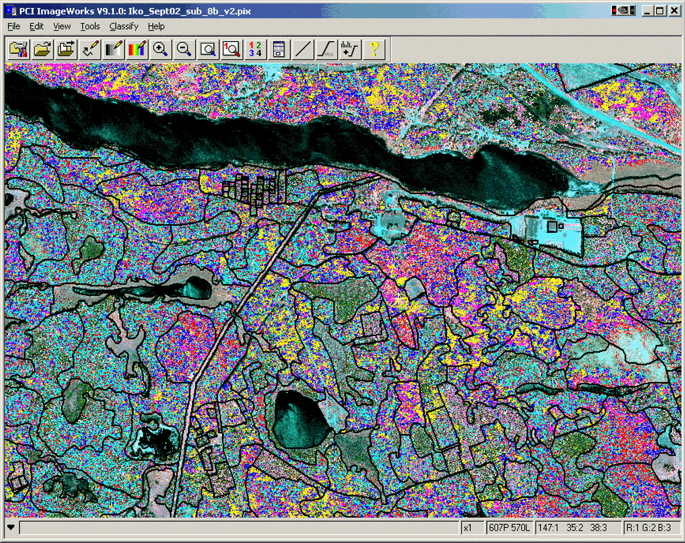
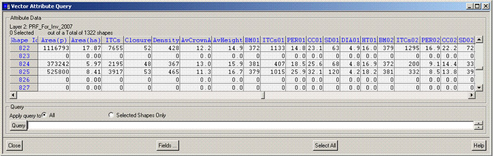
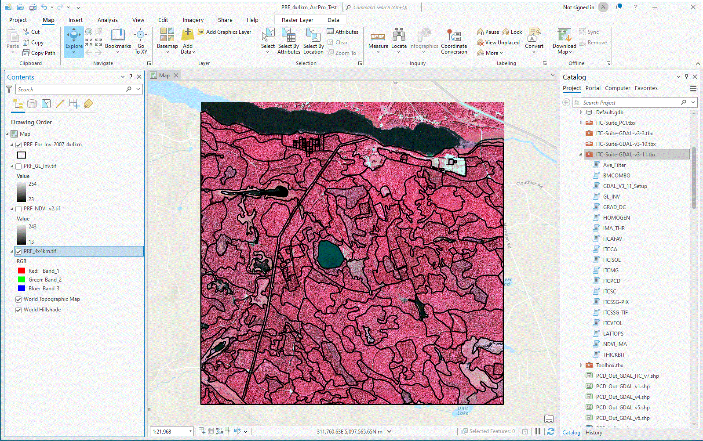

# ITC-Suite_Docs --- Main documentation directory

## Individual tree crown (ITC) approach to forest inventory

Most forest inventories in Canada are still produced largely through the interpretation of images and anchored by field surveys, 
a tedious and costly process. 
Improvements in the accuracy, timeliness and cost-effectiveness of forest information are badly needed, from the local to national and global levels.

With the advent of higher-resolution satellite and aerial sensors, as well as more sophisticated computer image analysis, Canadian Forest Service researchers 
at the Pacific Forestry Centre have been working on a different approach. 
Instead of delineating large ensembles like forest stands and then assessing their content, they recognized that it would be more useful 
for computers to delineate individual tree crowns(ITCs), assess their species and then regroup them into forest stands (if needed).

The researchers have developed the ITC Suite, consisting of about 35 computer programs that use this approach. 
The system is semi-automatic, requiring people only to provide sample areas or trees with which to “train” the computer in species recognition, and then to assess the results.

__Figure 1 -__ ITC-based forest inventory of part of the Petawawa Research Forest, Ontario.

Training the computer to consistently recognize more than a dozen species over the inventory area involves masking the non-forested areas and then delineating ITCs in all of the images, 
classifying them into species, and regrouping them into typical forest stands (Figure 1). 
Precise species composition and other forest information is produced for each stand in a format directly transferable to a Geographic Information Systems (Figure 2).

__Figure 2 -__ ITC-based stand information typically transferred to GeographicInformation Systems.

Aerial LiDAR data or stereo image autocorrelation can be  used to produce precise Digital Canopy Model(DCM), 
which can in turn be used to assess forest stand heights or ITC heights. 
Wood volumes can be calculated the conventional way but using more precise species compositions, 
or on a stand basis, or on an ITC basis, as functions of species, crown area, and height.

[Stand’s species composition and ITC-based volume](https://ostrnrcan-dostrncan.canada.ca/handle/1845/218112)

Even though the ITC-Suite was originally developed to analyse aerial multispectral data,
images from the current generation of high-resolution satellites can also be used for ITC-based forest analysis.

[ITCs from high spatial resolution satellite images](https://ostrnrcan-dostrncan.canada.ca/handle/1845/222640)

Of course, the ITC-Suite can also be used to analyse data from drone acquisitions, 
although it is generally advisable to degrade the image resolution to around 30-50 cm/pixel.

In addition, the ITC Suite has been used for a variety of specialized inventories (e.g., single species or snag detection, damage and health issues, gap assessments) 
and has specialized modules for regeneration assessments.

While the ITC information is currently regrouped at the forest stand level, 
it may soon be gathered and used directly for forest management and operation planning. 

With high-resolution satellite or aerial images, precise, accurate and timely semi-automatic ITC-based forest inventories could replace the costly process being used today.

Originally developed for the PCI Catalyst/Geomatica/EASI environment, the ITC-Suite (GDAL version) is now available for the ArcGIS or ArcGIS Pro environment as shown below:

__Figure 3 -__ The ITC-Suite  (GDAL version) used within ArcGIS

 

## List of ITC-Suite Programs

### <ins>Pre-Processing</ins>

**AVE_FILTER - Average Smoothing**

- To produce a smoothed image useful (needed) for itcvfol_g of the ITC-Suite

**ITCAFAV - Adaptive Smoothing**

- To smooth various image areas "more or less" depending on needs.

**BMCOMBO - Bitmap combinations**

- Program to combine two bitmaps into a third one

**IMA_THR - Image Thresholding**

- To threshold (using a range) an image channel, typically to produce the non-forest mask

**NDVI_IMA - Normalized Vegetation Index Image**

-  	From two input images assumed nIR and RED, this program creates an NDVI image

**GLINV - Grey Level Invertion of an Image**

- Works with 8-bit or 16-bit images, but only 8 to 8, 16 to 16

**GRAD_DC - Gradient-based Directionality Content**

- Produces an output image related to the amount of gradient directionality found in
  small areas (blocks) of the input image in a direction commensurate with SUNANG

**HOMOGEN - Homogeneity (OR Inhomogeneity) within an image**

- Produces an output image convaying the texture "homogeneity"
	of the input image based on a specific variable (HOMOVAR)

### <ins>ITC-Analysis</ins>

**LATTOPS - Locally Adaptive Tree Tops**

- Finds treetops (TTs) in dense areas and treetops with specific shadows
	in more open areas, as designated by the directionality mask (DIRMASK).

**ITCVFOL - Individual Tree Crown Valley Following**

- Produces an output bitmap (1 bit tif) representing lines and
	areas of shaded material between tree crowns. Done by following
	valleys of shaded material (dark) between brighter tree crowns.

**ITCISOL - Individual Tree Crown Isolation** 

- Produces an output bitmap (1 bit tif) showing
	distinct individual tree crowns (ITC) using
	a rule-based approach to continue and formalize the 
	outlines of tree crowns and tree clusters partially 
	delineated by ITCVFOL

**ITCMG - ITC Mask Generator (LIT/SHADED/TT)**

- Generates a bitmap assumed representative of the lit side, shaded side, or top of tree crowns

**ITCSSG - ITC Species Signature Generator**

- Generates ITC-based signatures for different species of trees.

**ITCSC - Individual Tree Crown (ITC) Supervised Classifier**

- Classifies the ITCs into different species using a Maximum-Likelihood decision rule.

**ITCCA - Individual Tree Crown (ITC) Classification Accuracy**

- Generates a confusion matrix for testing areas versus
 the classes resulting from the ITC classifications.  

### <ins>Post-Processing</ins>

**THICKBIT - Thicken bits in a bitmap**

- Thicken bits in a bitmap typically to make them more visible (e.g., from treetops)

 

##  Notes

The Suite can be used from a Windows "Command Prompt" window or a Linux terminal shell window.
I generally prefer to use the ITC-Suite that way, but that's me.
This feature is very useful to create simple text-based scripts towards more automation.
This should make possible the use of the ITC-Suite from other environments (e.g., R, Python)

 

Please check the main "plain text" manual of the GDAL version of the ITC-Suite:

[ITC-Suite_GDAL_Info.txt](./ITC-Suite_GDAL_Info.txt)

Compiling instruction are found at:

[GDAL_ITC-Suite_Compile.txt](./GDAL_ITC-Suite_Compile.txt)

[ITC-Suite_GDAL.chm](./ITC-Suite_GDAL.chm)

Point to various HTML page showing results

[Individual tree crown (ITC) techniques](https://cfs.nrcan.gc.ca/projects/102)

[ITC analysis of satellite images](https://cfs.nrcan.gc.ca/projects/103)

[ITC analysis of aerial images](https://cfs.nrcan.gc.ca/projects/113)

[Forest regeneration assessment techniques](https://cfs.nrcan.gc.ca/projects/114)

Many publications about the ITC-Suite and its many applications can be found at:

