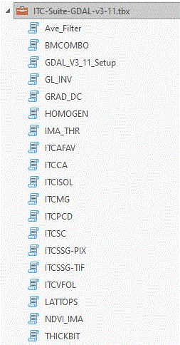

# ITC-Suite_Docs --- Main directory of documentation for the ITC-Suite

## Individual tree approach to forest inventory

Most forest inventories in Canada are still produced largely through the interpretation of images and anchored by field surveys, 
a tedious and costly process. 
Improvements in the accuracy, timeliness and cost-effectiveness of forest information are badly needed, from the local to national and global levels.

With the advent of higher-resolution satellite and aerial sensors, as well as more sophisticated computer image analysis, Canadian Forest Service researchers 
at the Pacific Forestry Centre have been working on a different approach. 
Instead of delineating large ensembles like forest stands and then assessing their content, they recognized that it would be more useful 
for computers to delineate individual tree crowns(ITCs), assess their species and then regroup them into forest stands (if needed).

The researchers have developed the ITC Suite, consisting of about 35 computer programs that use this approach. 
The system is semi-automatic, requiring people only to provide sample areas or trees with which to “train” the computer in species recognition, and then to assess the results.

__Figure 1 -__ ITC-based forest inventory of part of the Petawawa Research Forest, Ontario.

Training the computer to consistently recognize more than a dozen species over the inventory area involves masking the non-forested areas and then delineating ITCs in all of the images, 
classifying them into species, and regrouping them into typical forest stands (Figure 1). 
Precise species composition and other forest information is produced for each stand in a format directly transferable to a Geographic Information Systems (Figure 2).

__Figure 2 -__ ITC-based stand information typically transferred to GeographicInformation Systems.

Aerial LiDAR data or stereo image autocorrelation can be  used to produce precise Digital Canopy Model(DCM), 
which can in turn be used to assess forest stand heights or ITC heights. 
Wood volumes can be calculated the conventional way but using more precise species compositions, 
or on a stand basis, or on an ITC basis, as functions of species, crown area, and height.

REFER TO BC-X-460

Even though the ITC-Suite was originally developed to analyse aerial multispectral data,
images from the current generation of high-resolution satellites can also be used for ITC-based forest analysis.

REFER TO BC-X-445

Of course, the ITC-Suite can also be used to analyse data from drone acquisitions, 
although it is generally advisable to degrade the image resolution to around 30-50 cm/pixel.

In addition, the ITC Suite has been used for a variety of specialized inventories (e.g., single species or snag detection, damage and health issues, gap assessments) 
and has specialized modules for regeneration assessments.

While the ITC information is currently regrouped at the forest stand level, 
it may soon be gathered and used directly for forest management and operation planning. 

With high-resolution satellite or aerial images, precise, accurate and timely semi-automatic ITC-based forest inventories could replace the costly process being used today.

Originally developed for the PCI Catalyst/Geomatica/EASI environment, the ITC-Suite is now available for the ArcGIS or ArcGIS Pro environment as illustrated below:

__Figure 3 -__ The ITC-Suite used within ArcGIS

__Figure 4 -__ List of ITC-Suite programs available under ArcGIS or ArcGIS Pro

Instead,,, make a real list a a one liner explantion of each program

The Suite can be used from a Windows "Command Prompt" window or a Linux shell window 

Point to the various manuals

Point the all papera via Publications_X.html

